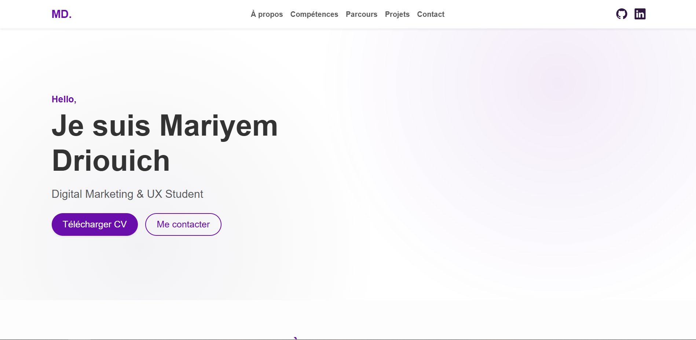
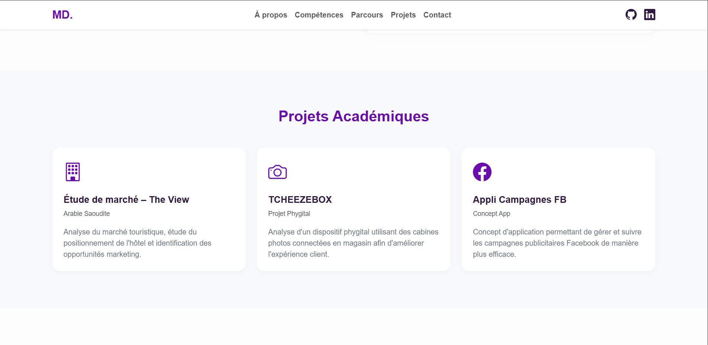
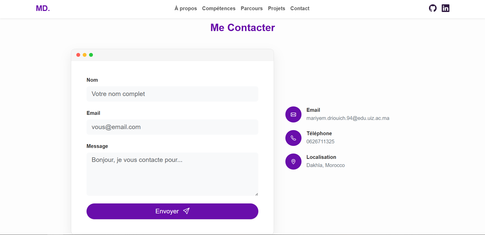

# 🌐 Mariyem Driouich — Portfolio Universitaire

Un portfolio simple, responsive, créé dans le cadre d'un projet universitaire. Il est développé avec **Bootstrap 5** avec un design basique et des couleurs personnalisées neutres pour un style étudiant. Il sera déployé sur **GitHub Pages**.

---

## 📸 Captures d'écran

### Section Accueil (Hero)


### Section Projets


### Section Contact


---

## ✨ Fonctionnalités

- **Design Responsive** — Adaptable sur mobile, tablette et ordinateur
- **Profil Centralisé** — Informations modifiables facilement depuis le fichier `assets/js/script.js` dans la variable `STUDENT_PROFILE`
- **Thème Personnalisé** — Palette de couleurs basée sur le fichier original `colors.png` du projet
- **CV Téléchargeable** — Bouton de téléchargement du CV en format PDF

---

## 🛠️ Technologies Utilisées

| Technologie | Utilisation |
|---|---|
| **HTML5** | Structure sémantique (Layout d'une page unique) |
| **CSS3** | Styles de base, couleurs avec variables CSS (style.css) |
| **JavaScript** | Insertion des données du profil dynamiquement (script.js) |
| **Bootstrap 5** | Grilles, Navbar, Cartes, Boutons, Formulaires |
| **GitHub Pages** | Hébergement et déploiement |

---

## 📁 Structure du Projet

```text
├── index.html                  # Fichier principal du portfolio
├── README.md                   # Documentation du projet
└── assets/
    ├── Mariyem_Driouich_CV.pdf # CV au format PDF
    ├── css/
    │   └── style.css           # Feuille de style personnalisée
    ├── img/
    │   └── screenshots/        # Captures d'écran pour le README
    │       ├── contact.png
    │       ├── hero.png
    │       └── projects.png
    └── js/
        └── script.js           # Configuration des données du profil
```

---

## 🚀 Déploiement

Ce site peut être déployé via **GitHub Pages** depuis la branche `main`.

Pour déployer vous-même :

```bash
git init
git add .
git commit -m "Initial commit - Portfolio"
git branch -M main
git remote add origin https://github.com/mariyemdriouich/mariyemdriouich.github.io.git
git push -u origin main
```

Ensuite, activez Pages sur GitHub dans **Settings → Pages → Source: Deploy from branch → main**.

---

## 🔗 Liens

- **GitHub:** [github.com/mariyemdriouich](https://github.com/mariyemdriouich)
- **LinkedIn:** [linkedin.com/in/maryam-adriouiche-9920413b6](https://www.linkedin.com/in/maryam-adriouiche-9920413b6)
- **Email:** mariyem.driouich.94@edu.uiz.ac.ma

---

## 📄 Licence

© 2025 Mariyem Driouich. Portfolio réalisé dans le cadre d'un projet étudiant.
